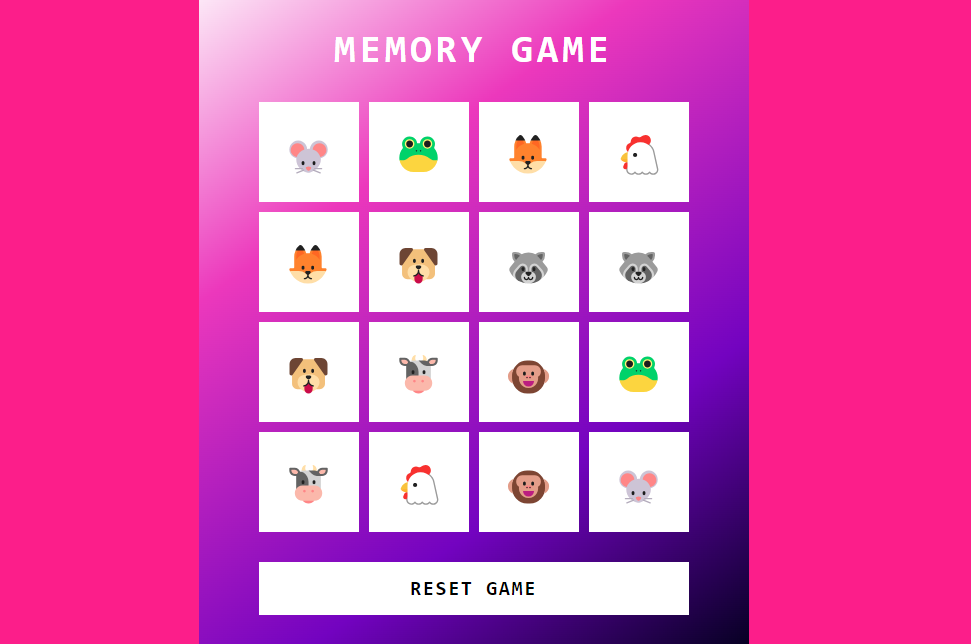

## Awesome JSGame Memory

  

Bem-vindo ao **JSGame Emoji Memory**! Neste repositório, você encontrará um jogo divertido de memória. Este projeto não apenas oferece entretenimento, mas também demonstra várias técnicas avançadas de desenvolvimento de jogos em JavaScript.

### Tecnologias Utilizadas

- HTML5 e CSS3 para a estrutura e aparência do jogo.
- JavaScript para a lógica de programação e interatividade.

### Contribuição

Contribuições são bem-vindas! Se você deseja melhorar este jogo, adicionar novos recursos ou corrigir problemas, sinta-se à vontade para abrir um _pull request_.

### Créditos

Este jogo foi desenvolvido como parte de um projeto educacional da Digital Innovation One.